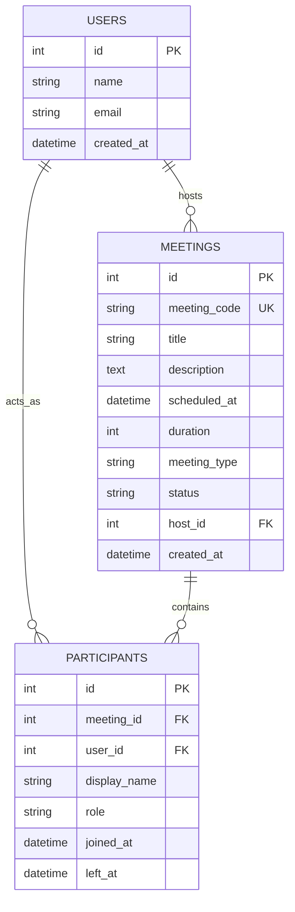

# Database Guide

The application uses an SQLite database with SQLAlchemy as the ORM. The schema is normalized into three main tables: `users`, `meetings`, and `participants`.

## ER Diagram


## Tables & Design Decisions

### 1. Users Table
- **Purpose:** Represents the physical people hosting or partaking in meetings.
- **Why it exists despite no auth:** Having a `users` table establishes a foundation for true identity management in the future. Currently, a default user (ID=1) is seeded and acts as the universal "Host" for testing purposes.
- **Columns:**
  - `id` (PK, Integer)
  - `name` (String)
  - `email` (String)

### 2. Meetings Table
- **Purpose:** Stores the details of both instant and scheduled meetings.
- **Why `meeting_code` is UNIQUE:** Meeting codes (`XXX-XXX-XXX`) are the primary public identifier used by users to join. They must be unique to prevent users from accidentally joining the wrong room.
- **Relationships:** Belongs to a host (`host_id` -> `users.id`). Has many `participants`.
- **Columns:**
  - `id` (PK)
  - `meeting_code` (Unique, Indexed)
  - `title`, `description`
  - `scheduled_at`, `duration`
  - `meeting_type` ("instant", "scheduled")
  - `status` ("scheduled", "active", "ended")
  - `host_id` (FK to `users`)

### 3. Participants Table
- **Purpose:** Tracks who is currently in a meeting, or who has been in a meeting.
- **Why Participants are separate from Users:** A single user can join many meetings over time. Furthermore, guest users might not have an account in the `users` table, so we need a place to store their temporary `display_name` and `role`. It acts as the join table between Users and Meetings with extra metadata.
- **Columns:**
  - `id` (PK)
  - `meeting_id` (FK to `meetings`)
  - `user_id` (FK to `users`, Nullable for guests)
  - `display_name` (String)
  - `role` ("host", "participant")
  - `joined_at`, `left_at` (used to determine if they are currently active)

## Example Query
To find all active participants in a given meeting code:
```sql
SELECT p.* 
FROM participants p
JOIN meetings m ON p.meeting_id = m.id
WHERE m.meeting_code = 'abc-def-ghi' 
AND p.left_at IS NULL;
```
