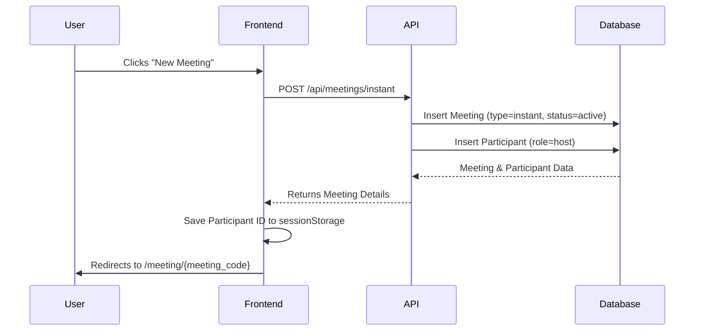
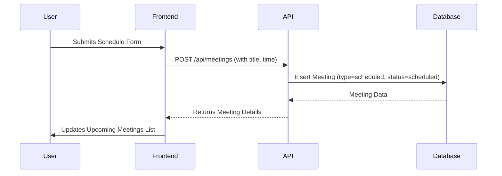
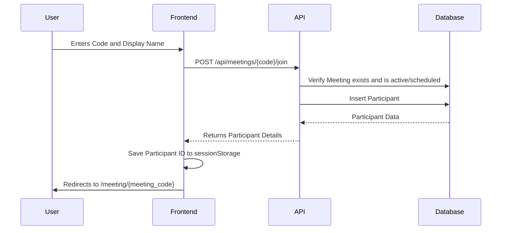
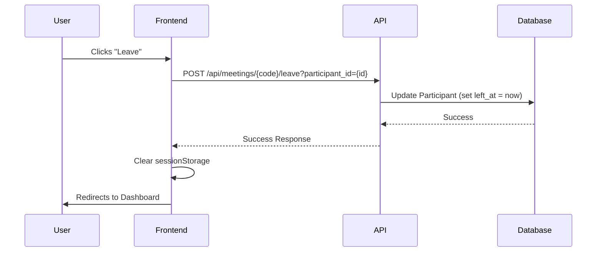

# Feature Flows

This document outlines the core workflows in the application using sequence diagrams.

## Instant Meeting Flow
When a user decides to start an immediate meeting.

## Schedule Meeting Flow
When a user sets up a meeting for the future.

## Join Meeting Flow
When a user attempts to join a meeting using a code.

## Leave Meeting Flow
When a user exits an ongoing meeting room.

